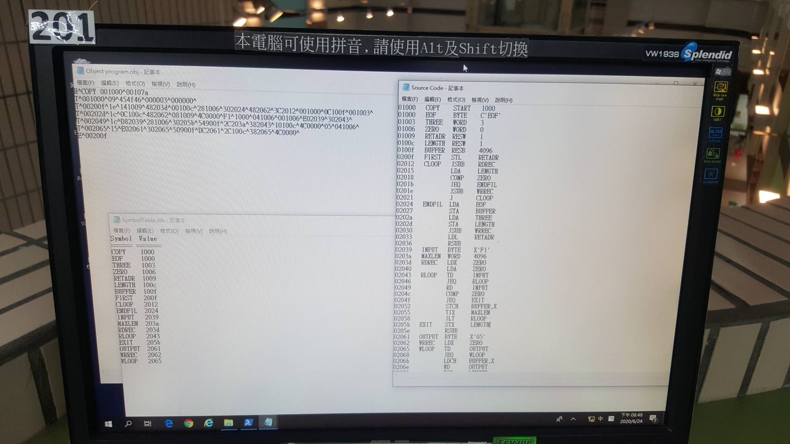

Topic Name : One-pass SIC Assembler

1. 組譯器之輸入： 
    SourceCode，副檔名為.asm 
    (ps. 測試檔名：input.asm) 

2. 組譯器之輸出： 
    I. 含位址值之Source Code，副檔名為 .lst 
    II. 符號表(SymbolTable)，副檔名為 .stb 
    III. Object program，副檔名為 .obj 
    (ps. 測試檔組譯後之輸出 test.lst, test.stb, test.obj) 

3. One-pass SIC 組譯器之執行方式如下(SICASM為One-pass SIC組譯器)： 
    SICASM test     <=輸出 test.obj 
    SICASM test –s  <=輸出 test.obj 和 test.lst 
    SICASM test –t  <=輸出 test.obj 和 test.stb 
    SICASM test –a  <=輸出 test.obj, test.lst 和 test.stb 
    
4. Optional： 
    1. 顯示目前組譯之SourceCode檔名 
    2. 下拉式表單，選擇輸出模式 
    3. 透過GUI決定SourceCode檔案載入位置 

執行:

1. git clone ...
2. open PowerShell
3. input : ./SINCAM test -a 
   (輸出 test.obj, test.lst 和 test.stb)

入下圖:

(ps : 南大圖書館電腦!!)